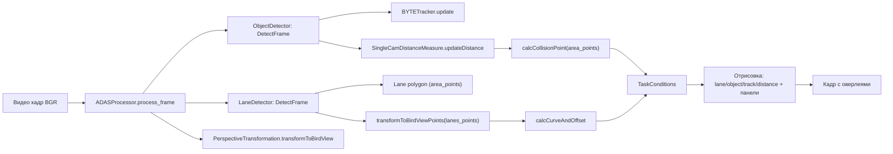

# ADAS (Vision-Guard) — предотвращение ДТП по видео

Проект реализует прототип системы помощи водителю (ADAS) для анализа видеопотока с фронтальной камеры и выдачи предупреждений:

1. **LDWS / LKAS** — контроль полосы движения (оценка смещения автомобиля относительно центра полосы + классификация кривизны дороги).
2. **FCWS** — контроль дистанции до объектов (автомобили, пешеходы и др.) на основе детекции + трекинга.

Документация сгенерирована по коду репозитория (см. `docs/`).

---

## Цели системы

- Обнаруживать разметку и вычислять:
  - смещение от центра полосы (для предупреждения о выходе за пределы),
  - направление и радиус кривизны (для информирования о повороте/прямолинейности).
- Детектировать ключевые классы объектов на дороге и:
  - вести треки (устойчивые ID),
  - оценивать приблизительную дистанцию до ближайшего объекта в зоне своей полосы,
  - выдавать уровни риска столкновения.

---

## Архитектура решения

### Компоненты (по коду)

- `adas_pipeline.py` — объединённый пайплайн: детекция объектов + трекинг + оценка дистанции + детекция полос + BEV + логика предупреждений + отрисовка UI-панелей.
- `ObjectDetector/` — детекторы (YOLO-onnx/trt, альтернативный EfficientDet-onnx), препроцессинг, NMS.
- `ObjectTracker/` — ByteTrack (Kalman Filter + ассоциация по IoU + fuse_score).
- `TrafficLaneDetector/` — UFLD/UFLDv2 (onnx/trt), преобразование в Bird’s Eye View, расчёт смещения/кривизны.
- `taskConditions.py` — стабилизация/агрегация метрик во времени и пороги для предупреждений.

### Схема обработки данных



---

## Основные алгоритмы (кратко)

### 1) Контроль дистанции (FCWS)

Pipeline:

1. Детекция объектов (YOLO ONNX/TRT, см. `ObjectDetector/yoloDetector.py`).
2. Трекинг объектов (ByteTrack, см. `ObjectTracker/byteTrack/byteTracker.py`).
3. Оценка расстояния по высоте bounding box (см. `ObjectDetector/distanceMeasure.py`):

Формула (используется приближение тонкой линзы и предположение о перспективе):

`D ≈ (H_real * f) / H_px`

где:
- `H_real` — эталонная высота класса (таблица в коде),
- `f` — фокусное расстояние (в коде константа `f=200`),
- `H_px` — высота bbox в пикселях.

Далее выбирается ближайший объект, который **попадает внутрь полигона текущей полосы** (`cv2.pointPolygonTest`).

### 2) Контроль полос (LDWS/LKAS)

Pipeline:

1. Детекция разметки (UFLD или UFLDv2, см. `TrafficLaneDetector/ufldDetector/*`).
2. Построение области своей полосы (`LaneDetectBase` формирует `area_points` как полигон).
3. BEV-преобразование (`PerspectiveTransformation`).
4. Расчёт смещения и кривизны по `np.polyfit` в BEV (см. `PerspectiveTransformation.calcCurveAndOffset`).
5. Стабилизация статусов и пороги предупреждений (см. `TaskConditions`).

---

## Используемые технологии

- Python + NumPy + OpenCV.
- Инференс моделей: ONNX Runtime (CPU/GPU), TensorRT (если используется `.trt`).
- Детекция объектов: YOLOv5…YOLOv10, альтернативно EfficientDet.
- Трекинг: ByteTrack.
- Детекция разметки: UFLD / UFLDv2.
- GUI (опционально): PySide6 (`main_desktop.py`).

---

## Пример работы

- Пример видео: `test.mp4`.
- Пример скриншота: `fe6d9b05-44a1-43b1-b82c-49395b110355.png`.

---

## Требования к окружению

### Зависимости

См. `requirements.txt` (OpenCV, NumPy, ONNX Runtime, PySide6 и т.д.).

### Важно про CUDA/TensorRT

В `coreEngine.py` выполняются импорты `tensorrt` и `pycuda.driver` на уровне модуля. Это означает:
- даже при запуске только ONNX/CPU, окружение должно содержать `pycuda` и `tensorrt`, иначе импорт упадёт;
- для воспроизводимости рекомендуется либо установить эти пакеты, либо вынести импорты в lazy-ветки.

---

## Установка

```bash
python -m venv .venv
.\.venv\Scripts\activate
pip install -r requirements.txt
```

---

## Запуск

```bash
python main_desktop.py
```

Примечание: пути к `.onnx/.trt` моделям задаются в `main_desktop.py:default_config()`.

---

## Полная документация

- `docs/README.md`
- `docs/pipeline/video_pipeline.md`
- `docs/algorithms/README.md`
- `docs/models/README.md`
- `docs/folders/README.md`

