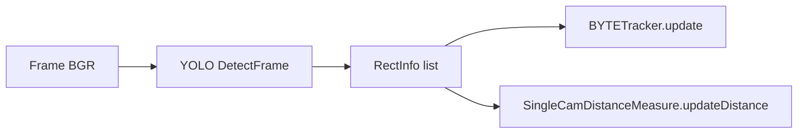

# Алгоритм: YOLO детекция объектов (2D Object Detection)

Документ описывает инженерную часть детекции объектов в проекте (YOLO‑семейство в формате ONNX/TRT) и показывает, как именно выполняются preprocess/postprocess в реализации.

---

## 1. Назначение алгоритма

**Задача.** По входному кадру получить набор детекций:

- bounding box (bbox),
- класс (`label`),
- уверенность (`conf`).

В ADAS‑контуре эти детекции используются:

- для **FCWS**: далее оценивается дистанция и выбирается объект в collision zone,
- для **MOT**: трекер (ByteTrack) связывает детекции между кадрами.

**Почему выбран YOLO.**

- Высокий FPS и низкая задержка на edge‑железе.
- Достаточно высокая точность на “транспорт/люди” при правильном выборе веса.
- Большая экосистема экспорта в ONNX/TensorRT.

**Альтернативы.**

- Двухстадийные детекторы: Faster R‑CNN (точнее, но медленнее).
- SSD/RetinaNet (компромисс).
- DETR‑подобные (качественно, но чаще тяжелее и требовательнее к обучению/постпроцессу).
- Segment‑based (Mask R‑CNN, YOLO‑Seg) для задач, где нужен контур.

---

## 2. Теоретическая основа

### 2.1. Формулировка задачи

Детектор оценивает множество объектов $O=\{o_i\}$, где каждый объект имеет параметры:

$$
o_i = (b_i, c_i, s_i),
$$

где:
- $b_i$ — bbox (например, $(x_1, y_1, x_2, y_2)$ или $(x, y, w, h)$),
- $c_i$ — класс,
- $s_i$ — confidence score.

### 2.2. Postprocess: порог + подавление дублей

После инференса обычно выполняются:

1) **фильтрация по score**:

$$
s_i \ge \tau_{score}
$$

2) **NMS/Soft‑NMS** для удаления дублей:

- классический NMS: жёстко удаляет bbox, если IoU выше порога,
- Soft‑NMS: **не удаляет**, а уменьшает score:

$$
s_j \leftarrow s_j \cdot f(\mathrm{IoU}(b_i, b_j))
$$

В проекте реализован Soft‑NMS (см. `ObjectDetector/utils.py`, класс `NMS`).

---

## 3. Архитектура модели (нейросеть)

YOLO — одностадийный детектор. Обобщённо:

- **Backbone**: извлечение признаков.
- **Neck**: объединение multi‑scale признаков (FPN/PAN).
- **Head**: предсказание bbox + objectness + class scores.

### Вход

Модель ожидает тензор `NCHW` с нормализацией:

$$
I_{norm} = \frac{I}{255}
$$

Конкретные размеры определяются ONNX‑моделью (`engine.get_engine_input_shape()`).

### Выход

В коде предусмотрены различия формата выхода:

- YOLOv5/6/7: массив детекций, где есть `obj_conf` и `cls_conf`.
- YOLOv8/9/10: формат иной, поэтому выполняется транспонирование (`output = output.T`).

### Loss‑функции (для понимания)

В репозитории обучение не реализовано, но типовые составляющие:

- bbox regression loss (IoU/GIoU/CIoU),
- objectness (BCE),
- classification (BCE/CE).

---

## 4. Pipeline обработки данных

Ниже — точная последовательность шагов, соответствующая реализации `YoloDetector`.

### Входные данные

- `srcimg`: BGR кадр `np.ndarray uint8` размера `(H, W, 3)`.

### Предобработка (preprocess)

1. **Letterbox resize** (с сохранением пропорций) через `Scaler.process_image(...)`:
   - изображение масштабируется и дополняется “паддингом” цветом `114`,
   - сохраняются параметры масштаба/паддинга для обратного преобразования bbox.
2. **Нормализация**: `1/255`.
3. **Преобразование в NCHW** через `cv2.dnn.blobFromImage(...)`.

### Основной алгоритм (inference)

- `engine.engine_inference(input_tensor)`:
  - `OnnxEngine` использует ONNX Runtime (CPU/CUDA),
  - `TensorRTEngine` использует TensorRT + PyCUDA.

### Постобработка (postprocess)

1. Приведение формата выхода под `ObjectModelType` (v8+ транспонируется).
2. Для v5‑семейства confidence рассчитывается как:

$$
s = s_{cls} \cdot s_{obj}
$$

3. Фильтрация по `box_score`.
4. Преобразование координат bbox обратно в исходный кадр:
   - `Scaler.convert_boxes_coordinate(...)`.
5. Soft‑NMS: `NMS.fast_soft_nms(..., dets_type="xywh")`.
6. Формирование `RectInfo`:
   - `(x, y, w, h, conf, label)`.

### Интеграция с другими модулями



---

## 5. Реализация в проекте

### Классы и функции

- Файл: `ObjectDetector/yoloDetector.py`
- Класс: `YoloDetector`
  - `DetectFrame(srcimg)`
  - `DrawDetectedOnFrame(frame_show)`

Сопутствующие сущности:

- `ObjectDetector/core.py`:
  - `RectInfo`
  - `ObjectDetectBase`
- `ObjectDetector/utils.py`:
  - `Scaler` (letterbox + обратные координаты)
  - `NMS.fast_soft_nms`
  - `ObjectModelType`
- `coreEngine.py`:
  - `OnnxEngine`, `TensorRTEngine`

### Как передаются данные

В `ADASProcessor.process_frame` (см. `adas_pipeline.py`):

- после `objectDetector.DetectFrame(frame)` детекции доступны как `objectDetector.object_info`,
- далее формируются:
  - `boxes = [obj.tolist(format_type="xyxy")]` (bbox),
  - `scores = [obj.conf]`,
  - `class_ids = [obj.label]` (в текущем коде это строковый label).

---

## 6. Псевдокод алгоритма

```pseudo
detect_yolo(frame_bgr):
  img = letterbox_resize(frame_bgr, target=(H_in, W_in), pad=114)
  blob = to_nchw_float(img/255)

  raw = engine.infer(blob)         # ONNX or TRT
  dets = parse_output(raw, model_type)

  keep = [d for d in dets if d.score >= box_score]
  keep = soft_nms(keep, iou=box_nms_iou)

  keep = unletterbox_boxes(keep, scaler_meta)
  return [RectInfo(box, score, label)]
```

---

## 7. Параметры и конфигурация

Параметры задаются через `object_config` (см. `adas_pipeline.py`, `main_desktop.py`).

| Параметр | Где | Значение по умолчанию | Назначение |
|---|---|---:|---|
| `model_path` | `YoloDetector._defaults` / config | `./models/yolov5n-coco.onnx` | путь к `.onnx` или `.trt` |
| `model_type` | config | `YOLOV5` | определяет разбор выхода |
| `classes_path` | config | `./models/coco_label.txt` | список классов |
| `box_score` | config | `0.4` | порог фильтрации детекций |
| `box_nms_iou` | config | `0.45` | IoU для Soft‑NMS |

Инженерные рекомендации:

- для ADAS чаще полезно **сужать набор классов** (car/truck/bus/person/motorbike) и повышать `box_score` для снижения шумов;
- измерять latency на целевом железе и выбирать размер веса (n/s/m/l);
- при переходе между YOLO версиями обязательно валидировать формат выхода ONNX и соответствие `ObjectModelType`.
